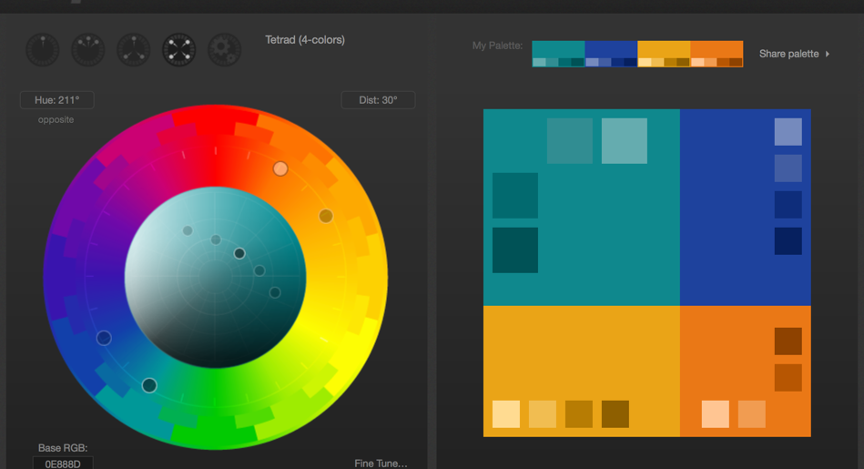

# Intee

Intee is a social media application used between interior designers to share their ideas and colaborate on projects.

## Framework and design
  * **Color scheme
    Paletton is an online application located on the internet at Paletton.com. It provides powerfull tool to create color combinations and palettes of colors that work together well. The major advantage of Paletton is it's not using the modern computer and engineering RGB color space, but it's built on a classical artistic color wheel, applies classical color theory and works within a specially created RYB color space. Therefore the color combinations it produces are very different from those you can get in many computer graphic applications.
  
  * Minimize Cognitive Load
Cognitive load refers here to the amount of brain power required to use the app. The human brain has a limited amount of     processing power, and when an app provides too much information at once, it might overwhelm the user and make them abandon the task.
  * Visual consistency
  Consistency is a fundamental principle of UX design. When things work in the way users predict, they feel a stronger sense of control. Unlike on desktop, where users can use hover effects to understand whether something is interactive or not, on mobile, users can check interactivity only by tapping on an element. That’s why, with buttons and other interactive elements, it’s essential to think about how the design communicates affordance.
## Funtionality

## Authenticatioon protocol
## Storage management and CRUD functions
## Architecture and technologies
This project is a starting point for a Flutter application.

A few resources to get you started if this is your first Flutter project:

- [Lab: Write your first Flutter app](https://flutter.dev/docs/get-started/codelab)
- [Cookbook: Useful Flutter samples](https://flutter.dev/docs/cookbook)

For help getting started with Flutter, view our
[online documentation](https://flutter.dev/docs), which offers tutorials,
samples, guidance on mobile development, and a full API reference.
