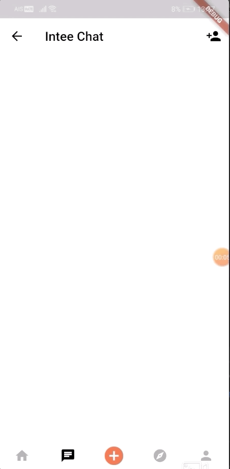

# Intee

Intee is a social media application used between interior designers to share their ideas and colaborate on projects.

## Framework and design
  * **Color scheme**\
    Paletton is an online application located on the internet at Paletton.com. It provides powerfull tool to create color combinations and palettes of colors that work together well. The major advantage of Paletton is it's not using the modern computer and engineering RGB color space, but it's built on a classical artistic color wheel, applies classical color theory and works within a specially created RYB color space. Therefore the color combinations it produces are very different from those you can get in many computer graphic applications.\
    

  * **Minimize Cognitive Load**\
Cognitive load refers here to the amount of brain power required to use the app. The human brain has a limited amount of     processing power, and when an app provides too much information at once, it might overwhelm the user and make them abandon the task.
  * **Visual consistency**\
  Consistency is a fundamental principle of UX design. When things work in the way users predict, they feel a stronger sense of control. Unlike on desktop, where users can use hover effects to understand whether something is interactive or not, on mobile, users can check interactivity only by tapping on an element. That’s why, with buttons and other interactive elements, it’s essential to think about how the design communicates affordance.\

## **Funtionality** 
  * Intee is a social media aplication used by interior designers and also clients who would like to find a potential designer for their home or business. You could use it to post and show off a cenrtain project, aswell as ask your friends input. The GUI apllication is built using Flutter and the database with Firebase.
   
  
  * The library page where all your posts, and projects are stored.
  
  The chat page where you could add friends and talk with them. 
  
  
  
  * The personal information page where you could use it to send to potential clients. 
  
    
  
  * This page alows you colaborate with friends and gives them controll to make changes or spot some mistake.
  
  

## **Authentication protocol**
*
## **Storage management and CRUD functions**
*

 

## **Architecture and technologies**
*
